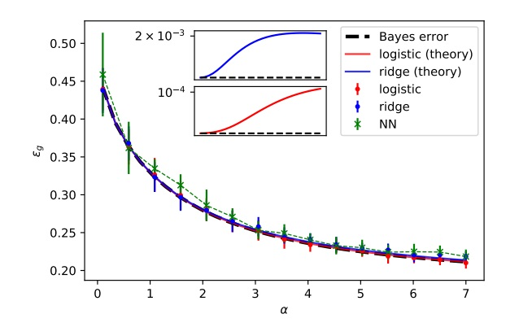

# Bayes_extensive

Code for the paper : <i>Bayes-optimal learning of random extensive-width networks</i> (<a href="https://proceedings.mlr.press/v202/cui23b.html">link to paper</a>)

<b>Bayes-optimal generalization errors</b>

- <tt>Multilayer_BO.ipynb</tt> implements the theoretical characterization of equations (12)-(14) for the Bayes-optimal regression error $\epsilon_{g,reg}^{BO}$ (4) associated to the learning of the target (2).

- <tt>Multilayer_BO_classification.ipynb</tt> implements the theoretical characterization of equation (15) for the Bayes-optimal classification error $\epsilon_{g,reg}^{BO}$ (5) associated to the learning of the target (2).

<b>ERM with linear methods</b>

- (<i>Linear regression</i>) <tt>Multilayer_Ridge_repl.ipynb</tt> returns the test error achieved by ridge regression, as characterized in equations (19) and (20).
- (<i>Logistic regression</i>) <tt>Multilayer_Logistic_repl.ipynb</tt> returns the test error achieved by logistic regression, discussed in subsection 4.4, see equation (275) in Appendix H.
- (<i>Ridge classification</i>) <tt>Multilayer_l2_class_repl.ipynb</tt> returns the test error achieved by ridge classification, discussed in subsection 4.4, see equation (272) in Appendix H.
- (<i>Random features</i>) <tt>Multilayer_RF_repl.ipynb</tt> returns the test error achieved by ridge classification characterized in (23). The corresponding infinite-width (kernel) limit is given in  <tt>Multilayer_kernel_lim_repl.ipynb</tt>, see equation (24).

<u> Versions:</u> These notebooks employ <tt>Python 3.12 </tt>, and <tt>Pytorch 2.5</tt>.

